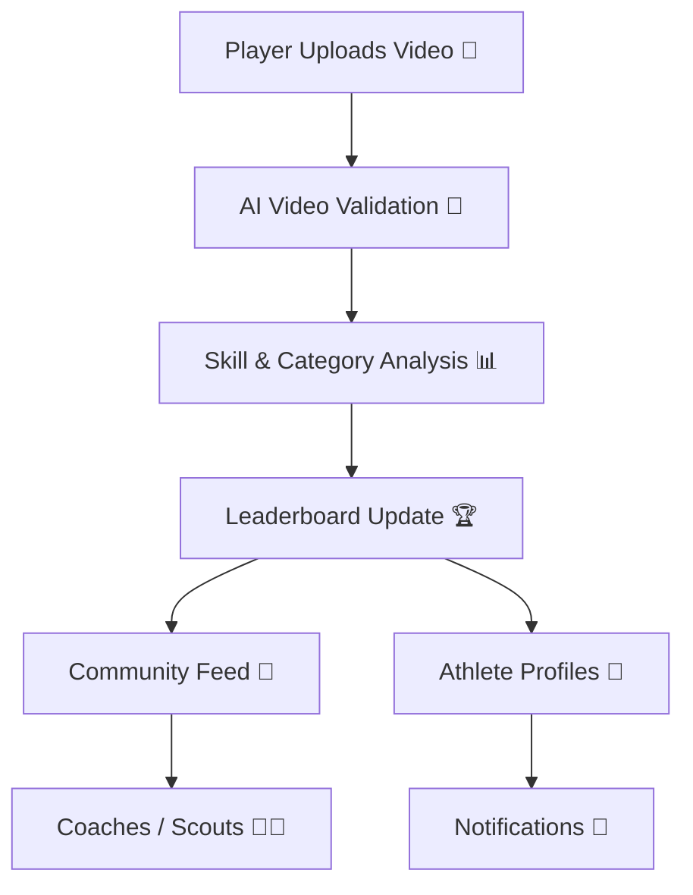
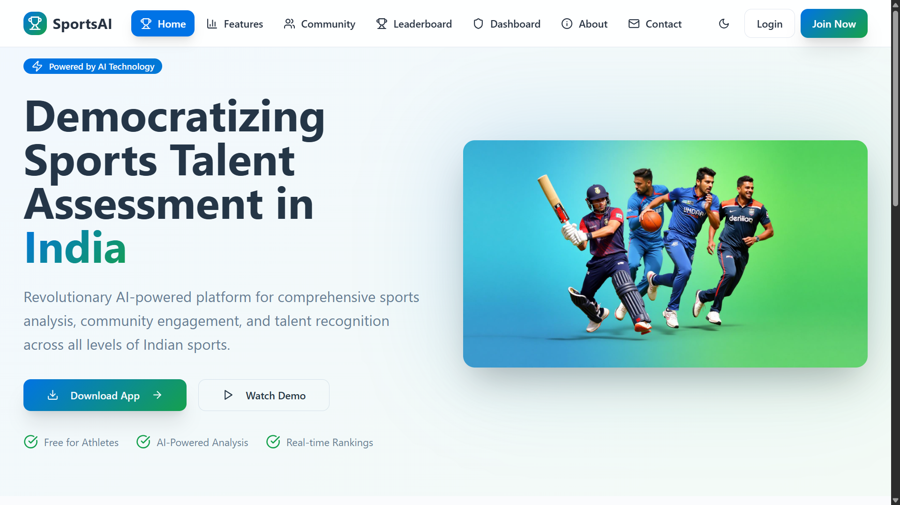
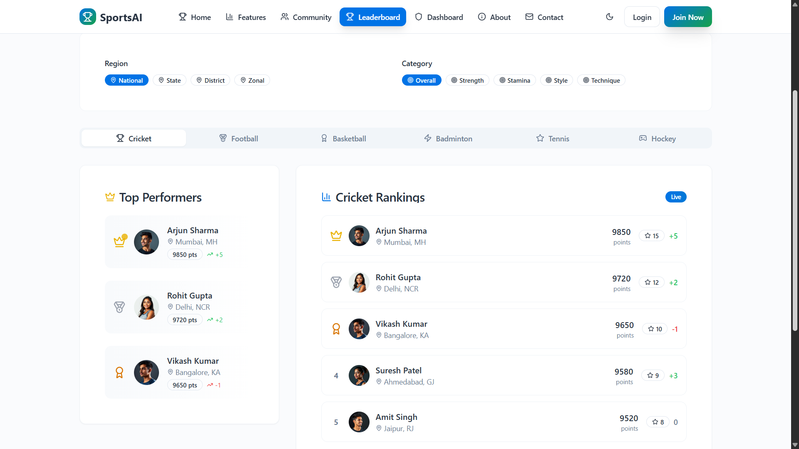
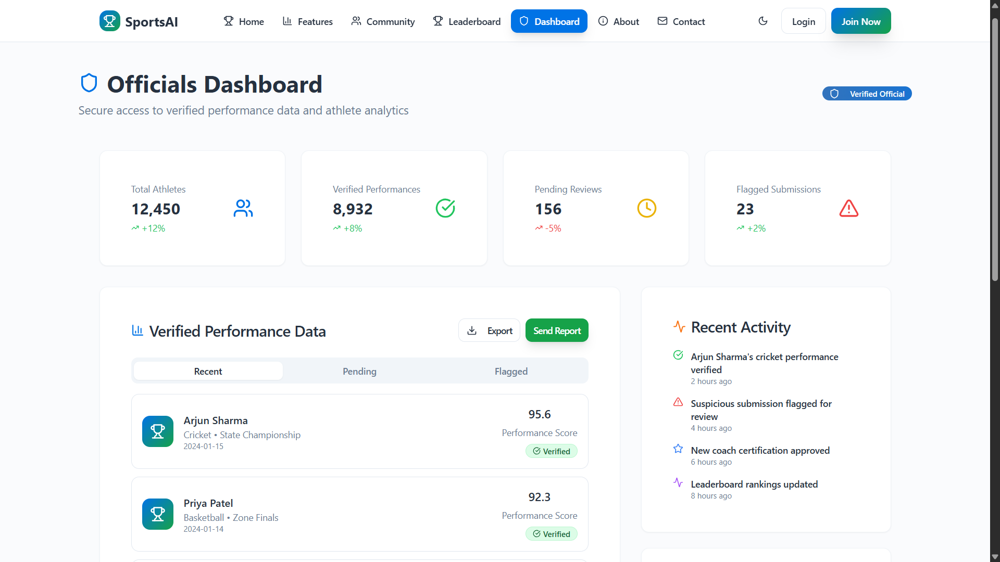

# 🏅 AthleteHub – AI-Powered Sports Leaderboard & Performance Tracker

<div align="center">

        

</div>

---

## 🚀 Introduction
**AthleteHub** is a **community-driven AI-powered sports platform** designed for athletes to **showcase achievements, upload performance videos, and track progress**. Unlike random video platforms, AthleteHub functions like a **sports library + leaderboard system**, ensuring structured recognition at **zonal, district, state, and national levels**.  

The platform leverages **AI video analysis** to validate performances, categorize skills (stamina, power, techniques), and maintain **fair leaderboards** across multiple sports. It empowers athletes with **transparent recognition, performance tracking, and community engagement**, while enabling coaches and federations to discover hidden talent across India.  

---

## ✨ Features  

| Feature | Description |
|---------|-------------|
| 👤 **Athlete Profiles** | Every athlete has a verified profile to upload certificates, achievements, and training videos. |
| 🏆 **Leaderboards** | Rankings by sport, zone, district, state, and national level with multiple performance categories. |
| 🎥 **AI Video Analysis** | Detects authenticity of videos, analyzes skills (e.g., sprint type, stamina, punching style). |
| 📊 **Performance Categories** | Separate rankings for stamina, technique, power, strategies, etc. |
| 🔔 **Smart Notifications** | Alerts on leaderboard changes, milestones, or performance improvements. |
| 🌍 **Community Hub** | Like Reddit/YouTube hybrid – athletes can share insights, progress, and training updates. |
| 🔒 **Trust & Fairness** | AI-based fraud detection + multi-step verification for video authenticity and profiles. |

---

## 🛠️ Tech Stack  

**Frontend:**  
        

**Backend:**  
        

**AI/ML:**  
      

---

## 🔧 AthleteHub — Flow Diagram  



---

## 📸 Screenshots  

<p align="center">
  <!-- Replace these image paths with your actual project screenshots -->
  
  
</p>

<p align="center">
  <!-- Replace these image paths with your actual project screenshots -->
  
  
</p>

---

## 📂 Resources  

<p align="center">
  <!-- Project Abstract -->
  <a href="Documents/SportsAI_PPT.pdf" target="blank">
    
  </a>
</p>

---

# File Tree: SportsAI - AI powered Sports Talent Assessment Website

```
├── 📁 .firebase/ 🚫 (auto-hidden)
├── 📁 .git/ 🚫 (auto-hidden)
├── 📁 dist/ 🚫 (auto-hidden)
├── 📁 node_modules/ 🚫 (auto-hidden)
├── 📁 public/
│   └── 🌐 index.html
├── 📁 react-firebase-leaderboard-app/
│   ├── 📁 src/
│   │   ├── 📁 assets/
│   │   │   └── 📄 .gitkeep
│   │   ├── 📁 components/
│   │   │   └── 📁 ui/
│   │   │       ├── 📄 avatar.tsx
│   │   │       ├── 📄 badge.tsx
│   │   │       ├── 📄 button.tsx
│   │   │       ├── 📄 card.tsx
│   │   │       └── 📄 tabs.tsx
│   │   ├── 📁 pages/
│   │   │   └── 📄 LeaderboardPage.tsx
│   │   ├── 📄 App.tsx
│   │   └── 📄 main.tsx
│   ├── 📄 .env.example
│   ├── 📄 .firebaserc
│   ├── 📖 README.md
│   ├── 📄 firebase.json
│   ├── 🌐 index.html
│   ├── 📄 package.json
│   ├── 📄 tsconfig.json
│   ├── 📄 tsconfig.node.json
│   └── 📄 vite.config.ts
├── 📁 sportspark-india-main/
│   ├── 📁 dist/ 🚫 (auto-hidden)
│   ├── 📁 node_modules/ 🚫 (auto-hidden)
│   ├── 📁 public/
│   │   ├── 📄 README-icons.txt
│   │   ├── 🖼️ favicon.ico
│   │   ├── 🖼️ placeholder.svg
│   │   ├── 📄 robots.txt
│   │   └── 📄 site.webmanifest
│   ├── 📁 src/
│   │   ├── 📁 assets/
│   │   │   ├── 🖼️ ai-analysis.jpg
│   │   │   ├── 🖼️ badminton-thumbnail.jpg
│   │   │   ├── 🖼️ basketball-thumbnail.jpg
│   │   │   ├── 🖼️ community.jpg
│   │   │   ├── 🖼️ cricket-thumbnail.jpg
│   │   │   ├── 🖼️ football-thumbnail.jpg
│   │   │   ├── 🖼️ hero-sports.jpg
│   │   │   ├── 🖼️ leaderboard.jpg
│   │   │   ├── 🖼️ profile1.jpg
│   │   │   ├── 🖼️ profile2.jpg
│   │   │   ├── 🖼️ profile3.jpg
│   │   │   ├── 🖼️ profile4.jpg
│   │   │   └── 🖼️ profile5.jpg
│   │   ├── 📁 components/
│   │   │   ├── 📁 ui/
│   │   │   │   ├── 📄 accordion.tsx
│   │   │   │   ├── 📄 alert-dialog.tsx
│   │   │   │   ├── 📄 alert.tsx
│   │   │   │   ├── 📄 aspect-ratio.tsx
│   │   │   │   ├── 📄 avatar.tsx
│   │   │   │   ├── 📄 badge.tsx
│   │   │   │   ├── 📄 breadcrumb.tsx
│   │   │   │   ├── 📄 button.tsx
│   │   │   │   ├── 📄 calendar.tsx
│   │   │   │   ├── 📄 card.tsx
│   │   │   │   ├── 📄 carousel.tsx
│   │   │   │   ├── 📄 chart.tsx
│   │   │   │   ├── 📄 checkbox.tsx
│   │   │   │   ├── 📄 collapsible.tsx
│   │   │   │   ├── 📄 command.tsx
│   │   │   │   ├── 📄 context-menu.tsx
│   │   │   │   ├── 📄 dialog.tsx
│   │   │   │   ├── 📄 drawer.tsx
│   │   │   │   ├── 📄 dropdown-menu.tsx
│   │   │   │   ├── 📄 form.tsx
│   │   │   │   ├── 📄 hover-card.tsx
│   │   │   │   ├── 📄 input-otp.tsx
│   │   │   │   ├── 📄 input.tsx
│   │   │   │   ├── 📄 label.tsx
│   │   │   │   ├── 📄 menubar.tsx
│   │   │   │   ├── 📄 navigation-menu.tsx
│   │   │   │   ├── 📄 pagination.tsx
│   │   │   │   ├── 📄 popover.tsx
│   │   │   │   ├── 📄 progress.tsx
│   │   │   │   ├── 📄 radio-group.tsx
│   │   │   │   ├── 📄 resizable.tsx
│   │   │   │   ├── 📄 scroll-area.tsx
│   │   │   │   ├── 📄 select.tsx
│   │   │   │   ├── 📄 separator.tsx
│   │   │   │   ├── 📄 sheet.tsx
│   │   │   │   ├── 📄 sidebar.tsx
│   │   │   │   ├── 📄 skeleton.tsx
│   │   │   │   ├── 📄 slider.tsx
│   │   │   │   ├── 📄 sonner.tsx
│   │   │   │   ├── 📄 switch.tsx
│   │   │   │   ├── 📄 table.tsx
│   │   │   │   ├── 📄 tabs.tsx
│   │   │   │   ├── 📄 textarea.tsx
│   │   │   │   ├── 📄 toast.tsx
│   │   │   │   ├── 📄 toaster.tsx
│   │   │   │   ├── 📄 toggle-group.tsx
│   │   │   │   ├── 📄 toggle.tsx
│   │   │   │   ├── 📄 tooltip.tsx
│   │   │   │   └── 📄 use-toast.ts
│   │   │   ├── 📄 Navigation.tsx
│   │   │   └── 📄 theme-provider.tsx
│   │   ├── 📁 hooks/
│   │   │   ├── 📄 use-mobile.tsx
│   │   │   └── 📄 use-toast.ts
│   │   ├── 📁 integrations/
│   │   │   └── 📁 supabase/
│   │   │       ├── 📄 client.ts
│   │   │       └── 📄 types.ts
│   │   ├── 📁 lib/
│   │   │   └── 📄 utils.ts
│   │   ├── 📁 pages/
│   │   │   ├── 📄 AboutPage.tsx
│   │   │   ├── 📄 CommunityPage.tsx
│   │   │   ├── 📄 ContactPage.tsx
│   │   │   ├── 📄 DashboardPage.tsx
│   │   │   ├── 📄 FeaturesPage.tsx
│   │   │   ├── 📄 HomePage.tsx
│   │   │   ├── 📄 Index.tsx
│   │   │   ├── 📄 LeaderboardPage.tsx
│   │   │   ├── 📄 LoginPage.tsx
│   │   │   ├── 📄 NotFound.tsx
│   │   │   ├── 📄 PrivacySecurityPage.tsx
│   │   │   └── 📄 SendReportPage.tsx
│   │   ├── 🎨 App.css
│   │   ├── 📄 App.tsx
│   │   ├── 🎨 index.css
│   │   ├── 📄 main.tsx
│   │   └── 📄 vite-env.d.ts
│   ├── 📁 supabase/
│   │   └── ⚙️ config.toml
│   ├── 🔒 .env 🚫 (auto-hidden)
│   ├── 🚫 .gitignore
│   ├── 📖 README.md
│   ├── 📄 bun.lockb
│   ├── 📄 components.json
│   ├── 📄 eslint.config.js
│   ├── 🌐 index.html
│   ├── 📄 package-lock.json
│   ├── 📄 package.json
│   ├── 📄 postcss.config.js
│   ├── 📄 tailwind.config.ts
│   ├── 📄 tsconfig.app.json
│   ├── 📄 tsconfig.json
│   ├── 📄 tsconfig.node.json
│   └── 📄 vite.config.ts
├── 📄 .firebaserc
├── 🚫 .gitignore
├── 📄 firebase.json
├── 📄 package-lock.json
└── 📄 package.json
```

---

## Contributing 🤝

Contributions are welcome! If you’d like to improve this project or add features, feel free to:

1. Fork the repo.
2. Create a new branch.
3. Submit a pull request.

I appreciate all suggestions for enhancement! 🙏

---

## Contact Me 📬

Let’s connect:

[](mailto:m.dinesh.it27@gmail.com)
[](https://www.linkedin.com/in/m-dinesh-d30/)
[](https://www.instagram.com/_dinx_pvt_430)
[](https://github.com/dineshit27)

Thanks for stopping by! 👋

---

### Made with ❤️ by **Dinesh M**
